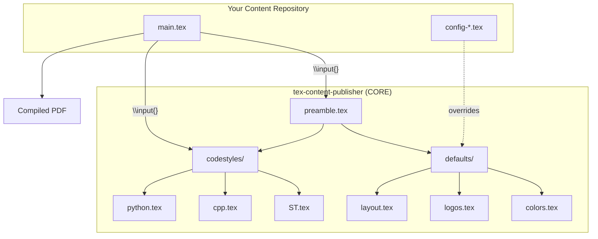
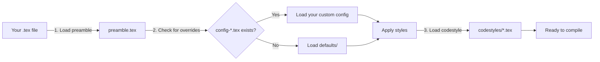
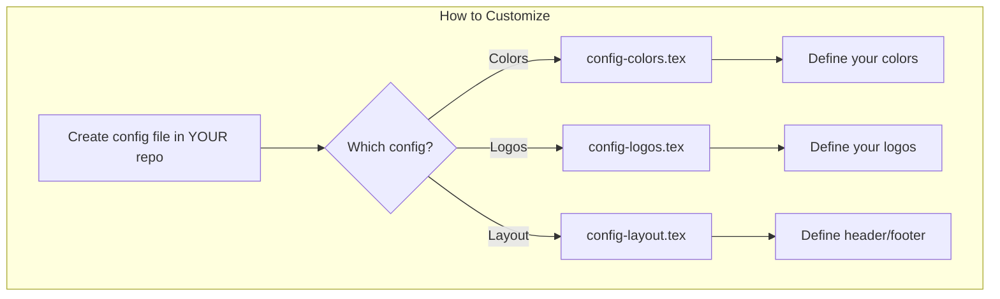

# TeX Content Publisher

Reusable LaTeX template system for technical publishing.

## Architecture Flow



## How It Works



## Usage

Add as submodule in your repo:

```bash
git submodule add https://github.com/your-user/tex-content-publisher .tex-publisher
```

In your `.tex` document:

```latex
\input{.tex-publisher/preamble}
\input{.tex-publisher/codestyles/cpp}  % or ST, python

\begin{document}
    % Your content here
\end{document}
```

## Structure

```
tex-content-publisher/
├── preamble.tex          # Main layout
├── defaults/
│   ├── colors.tex        # Default colors
│   ├── logos.tex         # Default logos
│   └── layout.tex        # Header/footer
└── codestyles/
    ├── ST.tex            # Structured Text
    ├── cpp.tex           # C++
    └── python.tex        # Python
```

## Customization (Override Defaults)



Create these files in your local folder to override defaults:

| Config File | Purpose | Overrides |
|-------------|---------|-----------|
| `config-colors.tex` | Custom colors | `defaults/colors.tex` |
| `config-logos.tex` | Your logos | `defaults/logos.tex` |
| `config-layout.tex` | Header/footer | `defaults/layout.tex` |

## Adding New Codestyles


1. Create `codestyles/yourlang.tex`
2. Define the language syntax highlighting
3. Import with `\input{.tex-publisher/codestyles/yourlang}`

## Available Codestyles

| Language | File | Use Case |
|----------|------|----------|
| Structured Text | `codestyles/ST.tex` | IEC 61131-3, PLCs |
| C++ | `codestyles/cpp.tex` | OpenCV, STL |
| Python | `codestyles/python.tex` | ML, scripting |